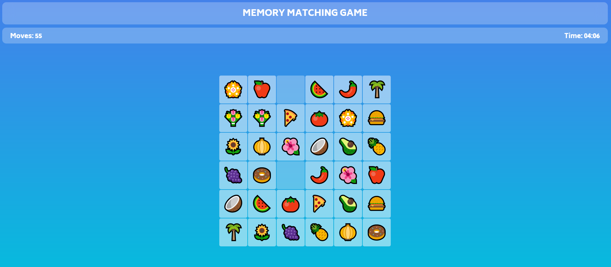

# Memory matching game

## <b> [Click here to Play the GAME!!](https://souradipporua.github.io/Game/)

This project is made using HTML,CSS &amp; JavaScript.
## ⭐ MEMORYGAME ⭐

This is my Portfolio Website which consist of my **latest work, projects and blogs** and this portfolio is built using **HTML5, CSS3 and Tailwind CSS**.

## 📌 **Live Site URL:** <a href="https://souradipporua.github.io/Game/">**Visit Now** 🚀</a>

 

## 📌 Tech Stack

&nbsp;
&nbsp;

## 📌 Overview

 

## 📬 Connect With Me

- **LinkedIn** - [Souradip-Porua](https://www.linkedin.com/in/souradip-porua-a49599192/)
- **Twitter** - [@porua_souradip](https://twitter.com/porua_souradip)

# souradipporua-Game

It's a simple online memory matching game, which contains various levels.
 
Here are some snapshots from game.

  # Game
# Game
#ENJOY THE GAME

